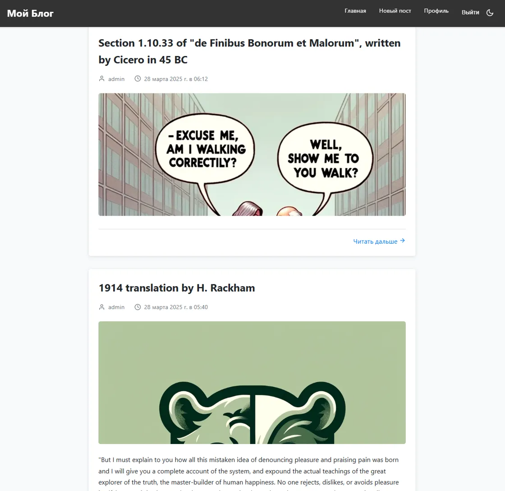
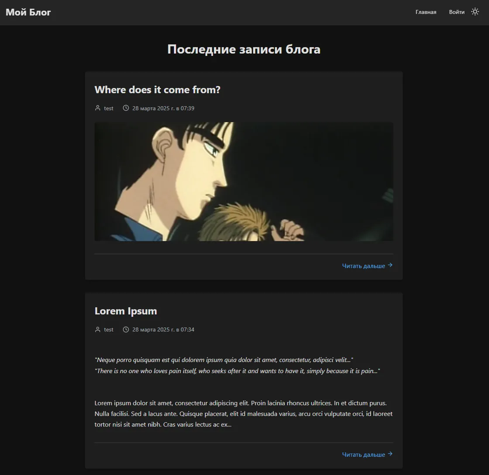
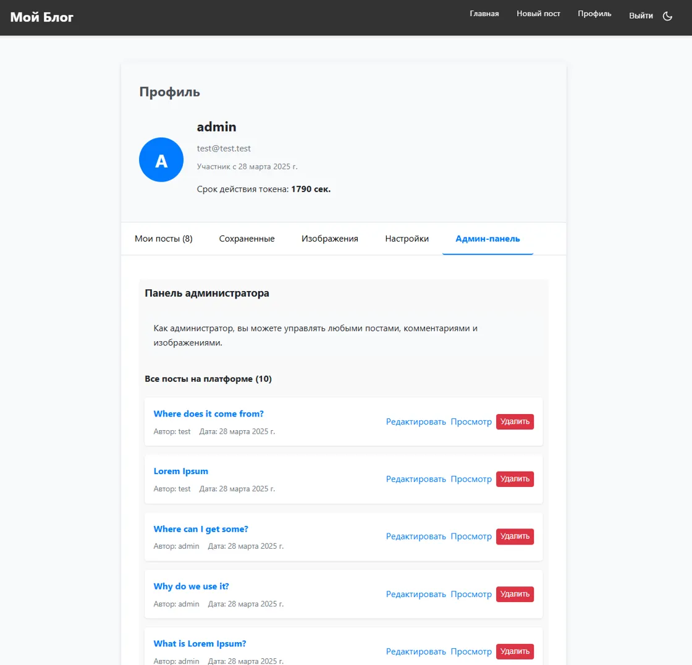

# Blog-site 0.0.1.8

## Overview

**Blog-site** is a modern blogging platform designed to provide an exceptional user experience with robust features and security.

## 🖼️ Screenshots





## 🌟 Core Features

### User Experience
- Light and dark theme support
- User registration and authentication
- Markdown-based post creation
- Image attachments in posts
- Commenting system

### User Management
- Edit and delete personal posts and comments
- View and manage uploaded images
- Add posts to "Favorites"
- Token-based authentication with expiration management

### Security
- Secured authentication routes
- Protection against XSS and SQL injection
- Refresh token management

### Administrative Capabilities
- Full access to all posts and comments
- Ability to edit/delete posts and comments across the platform

## 🛠️ Technology Stack

| Category | Technology |
|----------|------------|
| Backend | Flask |
| Frontend | Svelte |
| Database | SQLite |
| Proxying | Nginx |
| Deployment | Docker, Docker Compose |
| Authentication | JWT-based token system |

## 🚀 Quick Deployment

```sh
# Clone the repository
git clone https://github.com/mr9733n/blog-site.git
cd blog-site

# Build and start containers
docker-compose up --build -d
```

🌐 Access the application at `http://localhost:36166`

## 🔍 System Architecture

[View Backend Dependency Diagram](https://github.com/mr9733n/blog-site/blob/main/dependency_graph_20250328_134912.mermaid)

[System Architecture Graph](./dependency_graph_20250328_135030.svg)


## 🗺️ Roadmap

### Upcoming Features
- User list display
- User blocking functionality
- Server-side pagination
- Profile data editing
- Multi-language support (EN/RU)

### Infrastructure Improvements
- Production deployment optimization
- Enhanced logging
- SSL configuration
- Secure proxy setup

### Technical Enhancements
- Route structure optimization
- Svelte component architecture improvements
- Comprehensive unit testing

## 📋 Additional Resources

- [Detailed TODO List](https://github.com/mr9733n/blog-site/blob/main/todo.md)

## 📄 License

MIT License
